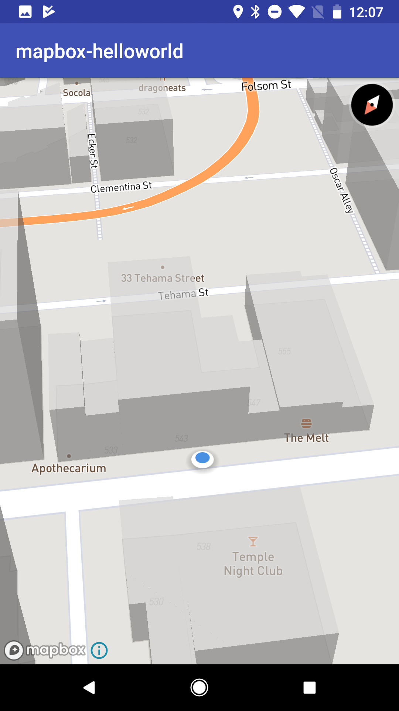

This is an example of Navisens' SDK integration with MapBox's SDK.

First get your MapBox token [here](https://www.mapbox.com/account/access-tokens) assign it to the `mapBoxToken` object, then retrieve a Navisens SDK key [here](https://navisens.com/).
And assign to the `navisensDevKey` object in `MainActivity.kt`, which will input the key into the `MotionDnaDataSource` object, which is in itself a wrapper for our MotionDnaSDK.

When you are done with your key retrieval, you can just run the project and it will work out of the box.

Have fun!

